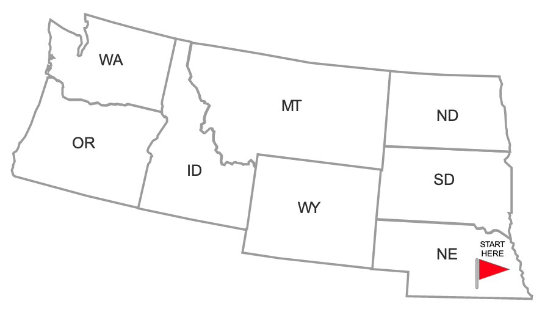

# Border Crossings #1

This week's puzzle is about planning a road trip. You've flown to Omaha, Nebraska and plan to rent a car and drive through each of the eight US states shows below:

Can you find a route that passes through all eight states in such a way that you cross each state border exactly once? That is, your route must pass:

- The Nebraska (NE) — Wyoming (WY) border once
- The Nebraska (NE) — South Dakota (SD) border once
- The South Dakota (SD) — Wyoming (WY) border once
- And so on

Feel free to use your favorite programming language to solve the problem. Bonus points if you can find *all* possible routes!

You can submit solutions via pull request or by emailing your code to recmath@davidamos.dev. If you submit a pull request, make sure your solution is added to the `solutions/` folder.

> **Note:** By submitting a solution you agree to make the code for your solution available under the MIT license.

I'll feature my solution and a couple of my favorite submitted solutions in a YouTube video on Sunday, July 18, 2021!
